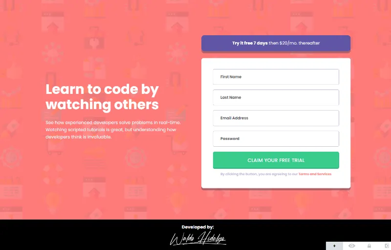
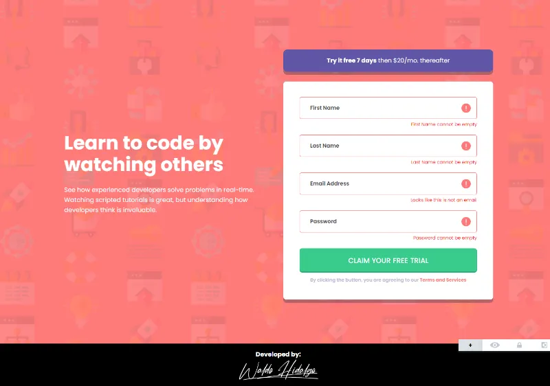

# Intro component with sign up form

Repositorio con el código solución al challenge: [Intro component with sign up form challenge on Frontend Mentor](https://www.frontendmentor.io/challenges/intro-component-with-signup-form-5cf91bd49edda32581d28fd1).

Proyecto construido utilizando Vite, Vue.js y TailwindCSS.

## Tabla de Contenidos

- [Intro component with sign up form](#intro-component-with-sign-up-form)
  - [Tabla de Contenidos](#tabla-de-contenidos)
  - [The challenge](#the-challenge)
  - [Diseños a Replicar](#diseños-a-replicar)
    - [1-Mobile Design](#1-mobile-design)
    - [2-Desktop Design](#2-desktop-design)
    - [3-Active States Design](#3-active-states-design)
  - [Proyecto Realizado](#proyecto-realizado)
    - [1-Mobile Size](#1-mobile-size)
    - [2-Desktop Size](#2-desktop-size)
    - [3-Active States Mobile](#3-active-states-mobile)
    - [4-Active States Desktop](#4-active-states-desktop)

## The challenge

El desafío consiste en realizar lo siguiente:

> Your challenge is to build out this introductory component and get it looking as close to the design as >possible.
>
> You can use any tools you like to help you complete the challenge. So if you've got something you'd >like to practice, feel free to give it a go.
>
> Your users should be able to:
>
> - View the optimal layout for the site depending on their device's screen size
> - See hover states for all interactive elements on the page
> - Receive an error message when the `form` is submitted if:
>
> - Any `input` field is empty. The message for this error should say _"[Field Name] cannot be empty"_
> - The email address is not formatted correctly (i.e. a correct email address should have this > structure: `name@host.tld`). The message for this error should say _"Looks like this is not an email"_

## Diseños a Replicar

### 1-Mobile Design

### 2-Desktop Design

### 3-Active States Design

## Proyecto Realizado

### 1-Mobile Size

### 2-Desktop Size

### 3-Active States Mobile

### 4-Active States Desktop

